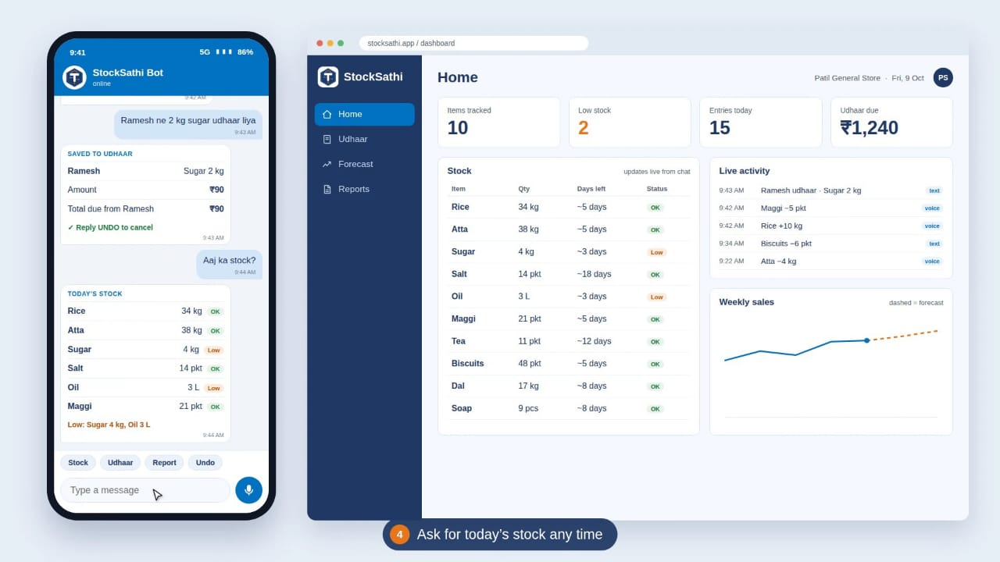
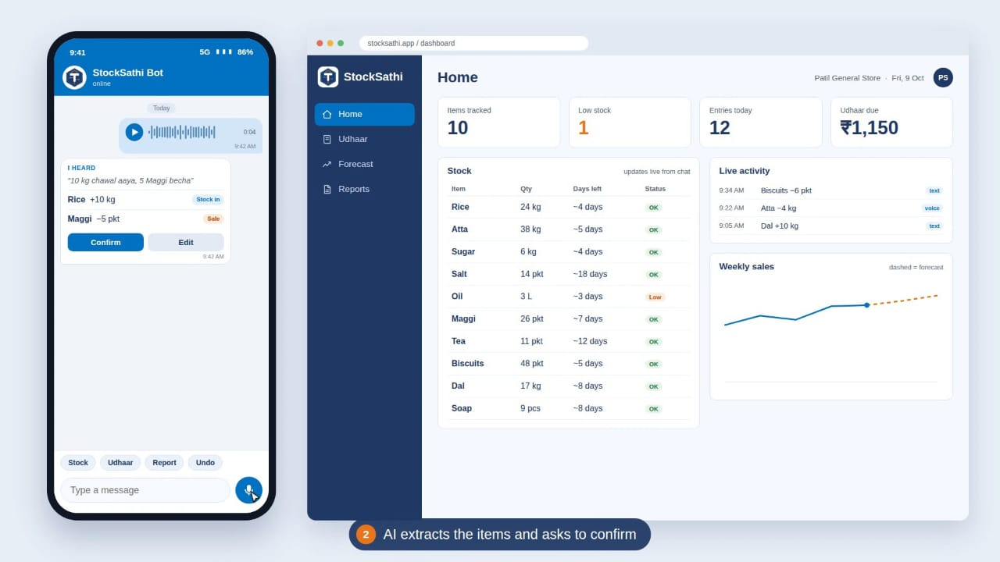
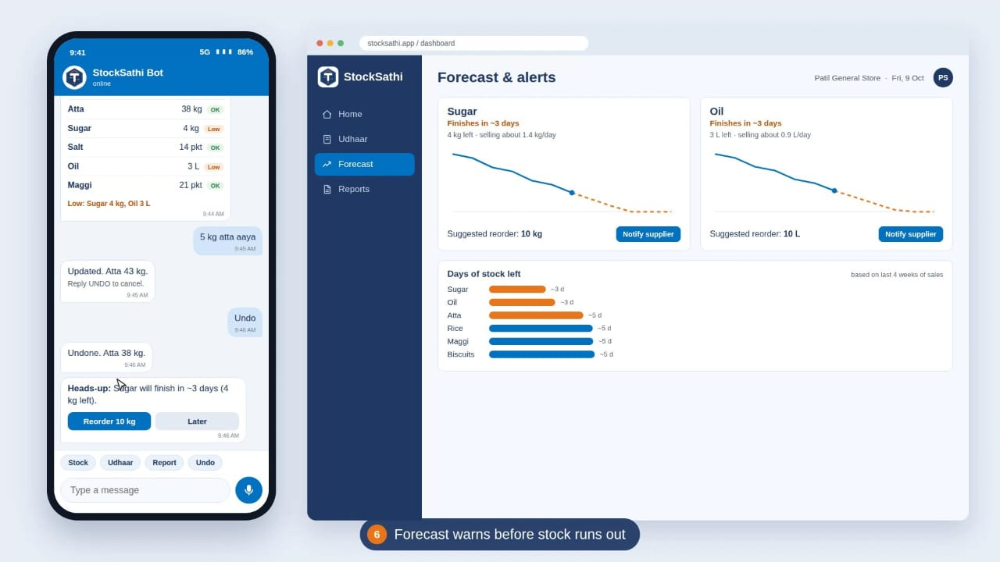
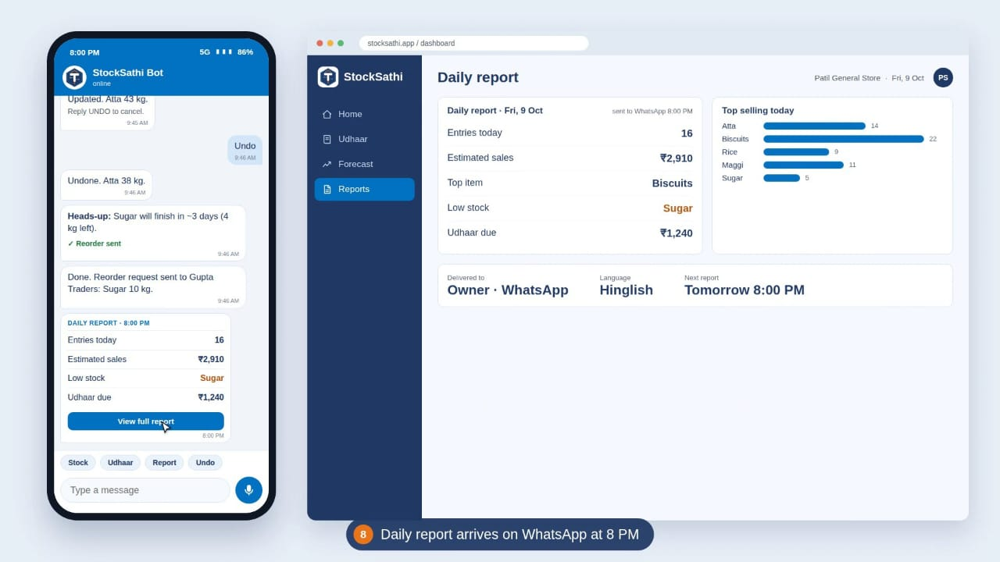
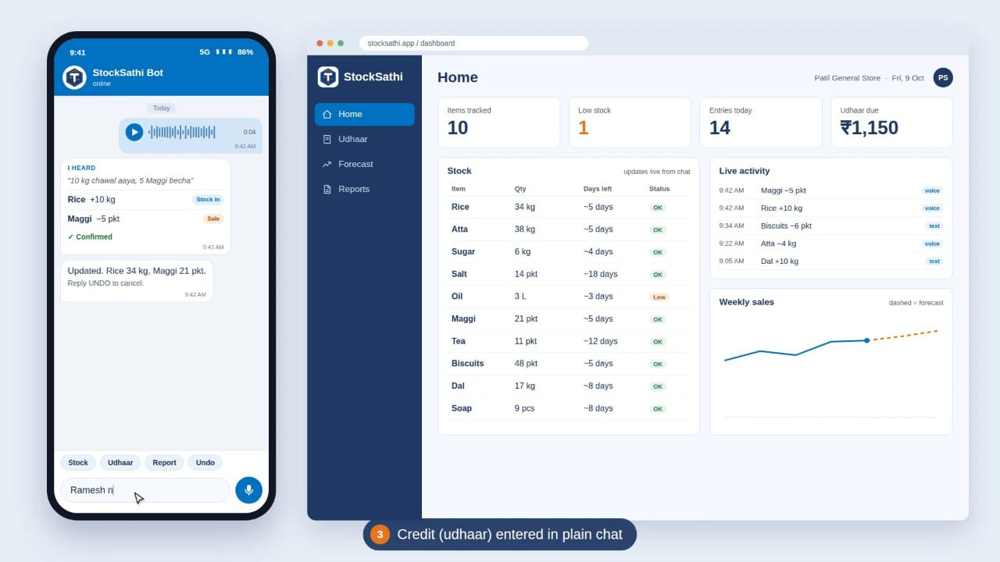
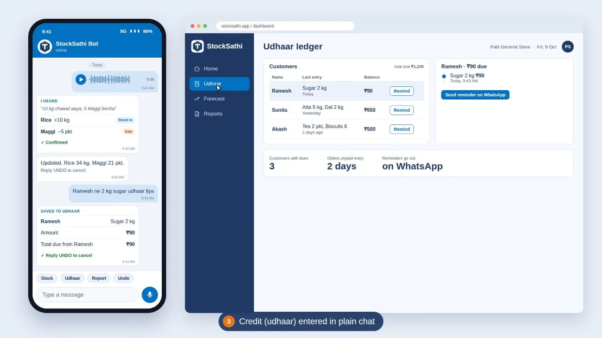
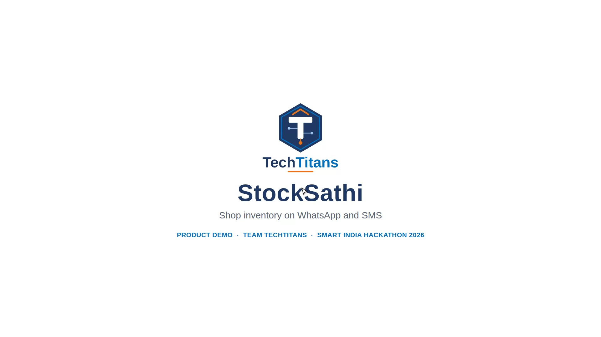

# 📈 StockSathi

### Smart Inventory Management for Local Vendors

**Smart India Hackathon 2026 | Team TechTitans**

StockSathi is a proposed digital inventory management solution designed for kirana stores, street vendors, and small wholesalers. It aims to simplify stock tracking through WhatsApp and SMS, helping local vendors manage inventory without complicated software or expensive systems.

Our goal is to make digital inventory management simple, accessible, and practical for everyday retail businesses.

---

## 🎨 Interactive Figma Prototype

🚀 **[Click here to explore the StockSathi Prototype](PASTE_YOUR_FIGMA_PROTOTYPE_LINK_HERE)**

The interactive prototype demonstrates the proposed interface and workflows for inventory tracking, AI-based message extraction, udhaar management, demand forecasting, and daily reports.

---

## ❗ Problem Statement

Small retailers often face challenges such as:

* Manual inventory tracking using paper notebooks.
* Unexpected stock-outs and product wastage.
* Difficulty tracking customer credit (udhaar).
* Complicated and expensive inventory management software.
* Limited access to digital tools in local languages.

## 💡 Our Solution

StockSathi proposes a WhatsApp/SMS-based inventory management assistant that enables shopkeepers to send text messages or voice notes to record stock movements.

The proposed system uses speech recognition and AI-based information extraction to identify products, quantities, and units, then validates entries before updating inventory records.

---

## 🚀 Key Features

* 💬 **WhatsApp/SMS Integration:** Record inventory updates through familiar messaging channels.
* 🎙️ **Voice-First Interaction:** Use voice notes for convenient stock entry.
* 📦 **Digital Inventory:** Maintain organized stock records.
* ⚠️ **Low-Stock Alerts:** Identify products that may need restocking.
* 💰 **Udhaar Ledger:** Track customer credit transactions.
* 📊 **Demand Forecasting:** Estimate future inventory requirements.
* 🗓️ **Daily Reports:** Summarize stock movements and inventory status.
* 🌐 **Regional Languages:** Aim to support local-language interactions.
* ↩️ **Confirm and Undo:** Help prevent and correct incorrect entries.
* 📱 **Simple Access:** Reduce the need to install and learn complex software.

---

## 🖥️ Prototype Screenshots

### 1. StockSathi Dashboard



### 2. AI-Based Message Extraction



### 3. Inventory and Stock Forecasting




### 4. Daily Inventory Report



### 5. Udhaar Management





### 6. StockSathi Project Identity



---

## ⚙️ Proposed Technical Architecture

1. **Input:** Shopkeeper sends a text message or voice note through WhatsApp/SMS.
2. **Webhook:** A FastAPI server receives the incoming message.
3. **Speech Recognition:** Whisper converts voice notes into text.
4. **AI Extraction:** An LLM extracts product names, quantities, and units.
5. **Validation:** Product matching and confirmation help reduce incorrect entries.
6. **Database:** Inventory and udhaar records are stored in a structured database.
7. **Smart Features:** Demand forecasting, low-stock alerts, and daily reports support better decisions.
8. **Dashboard:** A web dashboard provides an overview of stock and business activity.

---

## 🛠️ Proposed Technology Stack

| Component                  | Technology                     |
| -------------------------- | ------------------------------ |
| Backend                    | Python, FastAPI                |
| Frontend                   | React, Tailwind CSS, Chart.js  |
| Database                   | PostgreSQL                     |
| Caching / Background Tasks | Redis                          |
| Messaging                  | WhatsApp Cloud API, Twilio SMS |
| Speech Recognition         | Whisper                        |
| AI / NLP                   | LLM, spaCy                     |
| Demand Forecasting         | Prophet                        |
| Deployment                 | Docker, AWS / Azure            |

*Note: These technologies describe the proposed solution architecture. Their inclusion does not imply that every component has already been implemented.*

---

## 🎯 Target Users

* Kirana store owners
* Street vendors
* Small retailers
* Local wholesalers

## 🌱 Expected Impact

* Less time spent on manual inventory records.
* Better visibility into available stock.
* Earlier identification of potential stock shortages.
* Clearer tracking of customer credit.
* Improved restocking decisions.
* Reduced paperwork and avoidable product wastage.
* More accessible digital tools for local businesses.

---

## 🗺️ Proposed Development Roadmap

**Phase 1 — MVP**

* Text and voice input
* Inventory updates
* Basic dashboard

**Phase 2 — Smart Features**

* Udhaar ledger
* Demand forecasting
* Daily reports and alerts

**Phase 3 — Pilot and Scale**

* Pilot testing with local vendors
* Improve regional-language handling
* Expand based on user feedback

---

## 📂 Repository Structure

```text
StockSathi/
├── README.md
├── screenshots/
│   ├── stock.jpeg
│   ├── StockSathi.jpeg
│   ├── AiExtraction.jpeg
│   ├── DailyReport.jpeg
│   ├── forecast.jpeg
│   ├── forecast2.jpeg
│   ├── Udhar.jpeg
│   └── udhar2.jpeg
└── documentation/
    └── StockSathi_TechTitans.pdf
```

*The structure above represents the intended organization of project assets and documentation.*

---

## 👥 Team TechTitans

* Pallvi Jaywant Patil
* Shravani Bhimrao Fadatare
* Namrata Dilip Kachare
* Apurva Arvind Desai

## 📌 Project Status

**Current deliverable:** UI/UX prototype created using Figma.

This repository presents the StockSathi concept, prototype screens, and project documentation. The interactive Figma prototype demonstrates the proposed user experience; the complete backend and AI functionality should not be considered implemented unless separately developed and tested.

---

**StockSathi — Smarter Stock Management, Simpler Retail.**
